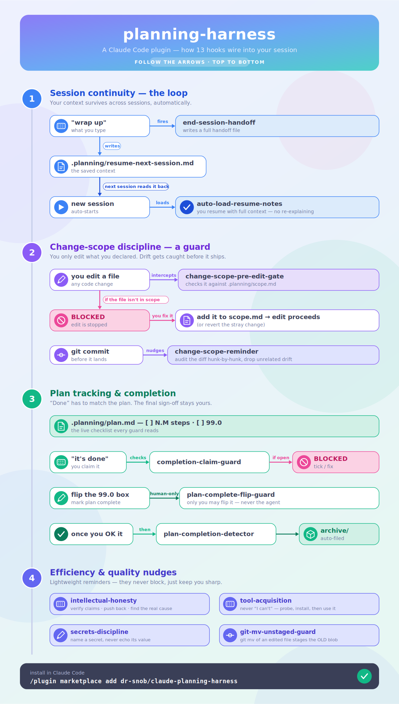

# planning-harness

<p align="center">
  
</p>

> **Follow the arrows:** each story starts from *what you type or do*, flows through the
> hook it fires, and shows what it reads/writes or where it **blocks** you. Story 1 is the
> loop that matters most — saying *“wrap up”* writes a handoff file that the next session
> reads back, so you never re-explain. Gold = a trigger, red octagon = a hard block.

A Claude Code plugin that adds a persistent **`.planning/` workflow**, a
**change-scope discipline**, and a set of **session-continuity and efficiency
hooks**. It keeps long, multi-session work coherent: resume handoffs survive
session boundaries, plan checkboxes get tracked, completion claims get verified
against the actual plan state, and unscoped drift gets caught before it ships.

Every hook **fails open** — if `jq`/`git` are missing, or the project has no
`.planning/` folder, the hooks stay silent and never block your work. They only
require `bash`, `jq`, and `git` (assumed present).

---

## The `.planning/` convention (in brief)

```
.planning/
├── resume-next-session.md          ← GLOBAL handoff (cross-plan / sidequest carries)
├── archive/<completed-plan>/       ← completed plans move here (history preserved)
└── <plan-name>/                    ← one self-contained folder per plan
    ├── plan.md                     ← phased plan; steps are `- [ ] **N.M** ...`
    ├── scope.md                    ← "Files in scope" manifest for the active change
    └── resume-next-session.md      ← PER-PLAN continuation handoff
```

Plan steps use bold dotted IDs (`**1.2**`). The final step `**99.0** Plan
COMPLETE <!-- plan-complete-trigger -->` is the **human-gated** completion marker —
only a human flips it, and flipping it prompts archival. Full spec:
[`docs/planning-folder-format.md`](docs/planning-folder-format.md). The change-scope
discipline is documented in
[`docs/change-scope-discipline.md`](docs/change-scope-discipline.md).

---

## Hooks

| Hook | Event | What it does |
|---|---|---|
| `auto-load-resume-notes.sh` | SessionStart | Finds the most relevant `.planning` resume handoff and tells the new session to read it in full before responding. |
| `end-session-handoff.sh` | Stop, SessionEnd | Requires writing/refreshing a comprehensive `resume-next-session.md` handoff before the session closes. |
| `completion-claim-checkbox-guard.sh` | Stop | Blocks a "plan/phase complete" claim while that plan/phase still has unchecked `**N.M**` boxes. Suppresses on honest "not done yet" status. |
| `plan-complete-flip-guard.sh` | PreToolUse `Edit\|Write\|MultiEdit` | Blocks flipping the final `**99.0**` box unless `PLAN_COMPLETE_AUTHORIZED` is set to the human's explicit words (audit-logged). |
| `plan-completion-detector.sh` | PostToolUse `Edit\|Write\|MultiEdit` | Detects a `**99.0**` flip and prompts moving the plan folder to `archive/` (idempotent via sidecar state). |
| `phase-transition-checkbox-reminder.sh` | UserPromptSubmit | On "next phase / move on / what's next" vocab, reminds you to tick the finished phase's boxes; flags phases whose `**N.0**` summary is unchecked while all sub-steps are checked. |
| `plan-folder-discipline-reminder.sh` | PostToolUse `Write\|Edit\|MultiEdit` | On `.planning` writes, reminds of folder completeness and 2-tier resume routing (global vs per-plan). |
| `change-scope-discipline-reminder.sh` | PreToolUse `Bash` | On `git commit`, injects the hunk-by-hunk diff-audit ritual reminder. |
| `change-scope-pre-edit-gate.sh` | PreToolUse `Edit\|Write\|MultiEdit` | BLOCKS edits to files outside the active `.planning/` scope manifest (with bypass + `.scope-ignore` escape hatches). |
| `intellectual-honesty-reminder.sh` | UserPromptSubmit | On debugging/proposal vocab, reminds to verify external-system claims, push back with reasoning, and trace upstream before SDK-level band-aids. |
| `tool-acquisition-reminder.sh` | UserPromptSubmit | On unsupported-format vocab (`.mov`, `.heic`, `.docx`…), reminds to probe → install → use a tool before claiming "I can't". |
| `secrets-discipline-reminder.sh` | UserPromptSubmit | On secret/credential vocab, reminds never to echo secret values into chat and to scan screenshots for visible secrets. |
| `git-mv-unstaged-guard.sh` | PreToolUse `Bash` | Blocks a `git commit` that would silently drop unstaged edits to a `git mv`'d file (the porcelain `RM` footgun). |

---

## Install

### Local (from this directory)

```
/plugin marketplace add /path/to/claude-planning-harness
/plugin install planning-harness@planning-harness
```

The first command registers this directory as a marketplace (its
`.claude-plugin/marketplace.json` catalogs a single plugin whose source is this
same repo). The second installs the plugin from that marketplace.

### From a git repo

Push this directory to a git host, then point others at it by URL:

```
/plugin marketplace add https://github.com/<you>/claude-planning-harness
/plugin install planning-harness@planning-harness
```

After install, restart Claude Code (or reload) so the hooks register. Confirm with
`/hooks` — you should see the events above wired to `${CLAUDE_PLUGIN_ROOT}/hooks/*`.

---

## Notes

- All hook commands are invoked as `bash "${CLAUDE_PLUGIN_ROOT}/hooks/<name>.sh"`,
  so the plugin is fully machine-agnostic — there are no hardcoded paths.
- State the hooks keep (completion sidecars, audit logs) lives under
  `~/.claude/state/` and `~/.claude/log/`, outside your project repos.
- To temporarily disable a blocking gate for a legitimate exception, the relevant
  hook documents its bypass env var in its block message.

MIT licensed — see [`LICENSE`](LICENSE).
